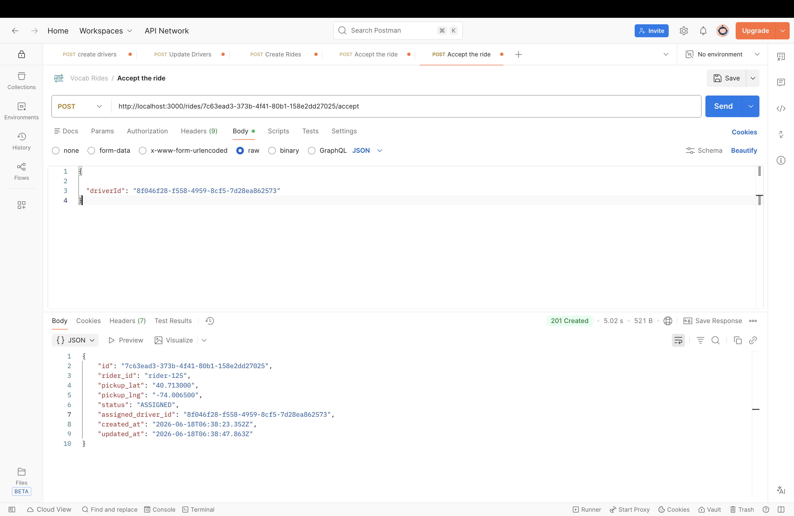
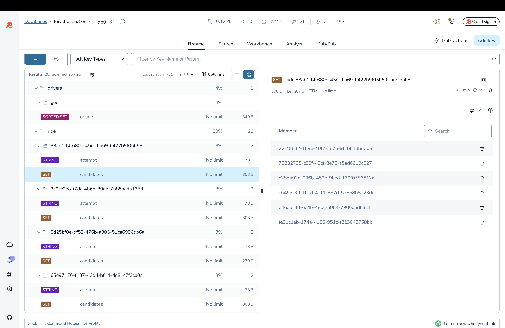
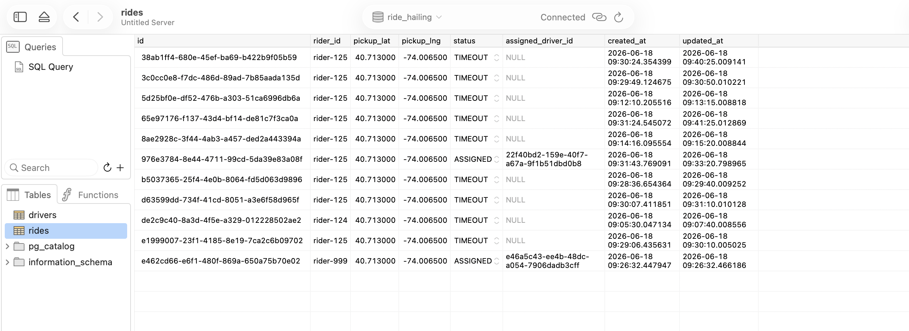

# Real-Time Driver Allocation System

This repository contains a backend service that simulates the core workflow of a ride-hailing platform. It efficiently handles driver discovery, high-concurrency requests, and reliable state assignment under load.

## 🛠 Technology Stack
* **Framework:** NestJS (Node.js)
* **Database:** PostgreSQL (Transactions & State Persistence)
* **Cache & Geo:** Redis (Geospatial Indexing & Distributed Locks)
* **Containerization:** Docker & Docker Compose

---

## 🚀 Setup Instructions

### Prerequisites
* Docker and Docker Compose
* Node.js (v18+)

### 1. Start the Infrastructure (Database & Redis)
Ensure Docker is running, then spin up the required containers:
```bash
docker compose build
docker compose up -d
```
*(This starts PostgreSQL on port 5433 and Redis on port 6379).*

### 2. Install Dependencies
```bash
npm install
```

### 3. Start the Application
```bash
npm run start:dev
```
The application will be available at `http://localhost:3000`.

---

## 🏗 System Design Overview

The architecture cleanly separates ephemeral real-time state from persistent historical state.

1. **Geo-Based Driver Search**: When a driver goes `ONLINE`, their coordinates are stored in a **Redis Geospatial Index** (`drivers:geo:online`). When a ride is requested, the system uses `GEORADIUS`/`GEOSEARCH` to find the top 10 closest drivers within a 10km radius in $O(\log(N))$ time.
2. **State Management**: The ride's lifecycle (`REQUESTED` -> `SEARCHING` -> `ASSIGNED` / `TIMEOUT`) is tracked safely in PostgreSQL to guarantee ACID compliance.
3. **Timeout & Retry Logic**: Once a batch of candidates is selected, they are given a defined time window to accept. A background scheduler monitors active rides. If a ride times out, the scheduler triggers a new search attempt, explicitly excluding drivers who were already asked.

---

## ⚡ Concurrency Handling Approach

Handling the race condition where multiple drivers tap "Accept" at the exact same millisecond is the most critical component of this system. 

To ensure strict idempotency and prevent double-booking, this application uses a **Layered Locking Strategy**:

1. **Layer 1: Distributed Redis Lock (Fail-Fast)**
   When an accept request arrives, the system attempts to acquire a Redis lock (`SET lock:ride:{id} NX PX 5000`). If Driver B's request arrives 2 milliseconds after Driver A, Driver B immediately fails to acquire the lock and receives a `409 Conflict` without ever querying the database. This protects the database from stampeding herds.
2. **Layer 2: Pessimistic Write Lock (Absolute Integrity)**
   Once Driver A holds the Redis lock, the system opens a PostgreSQL transaction and fetches the ride row using a `pessimistic_write` lock (`SELECT ... FOR UPDATE`). This guarantees that no other transaction can modify the ride's state while the assignment logic executes. 

This dual-layer approach provides both high throughput (via Redis) and absolute data consistency (via PostgreSQL).

---

## ⚖️ Assumptions and Trade-offs

Given the 4-6 hour constraint of this assignment, several trade-offs were made to deliver a functional core workflow:

1. **Timeout Scheduling Scalability**
   * **Implementation:** Timeout polling is currently handled by a local `@nestjs/schedule` cron job running every 5 seconds.
   * **Trade-off:** In a horizontally scaled production environment, having 5 Node instances running this cron job simultaneously would cause duplicate database querying and race conditions. 
   * **Production Fix:** This should be replaced with a distributed job queue (like **BullMQ** backed by Redis) or external orchestrator (AWS EventBridge) to ensure exact-once processing of timeouts.

2. **Location Update Bottlenecks**
   * **Implementation:** The `/location` endpoint synchronously updates both Redis and Postgres.
   * **Trade-off:** Writing GPS pings to a relational database every 3 seconds per driver will rapidly bottleneck PostgreSQL at scale.
   * **Production Fix:** Location pings should *only* write to Redis for real-time dispatching. A separate background worker or message queue (Kafka) should batch-sync these locations to an analytics database for historical tracking.

3. **Event Streaming & Notifications**
   * **Implementation:** The current system uses HTTP polling and logical console logs to represent driver notifications. 
   * **Trade-off:** Ride-hailing is inherently asynchronous.
   * **Production Fix:** The architecture requires an event bus (e.g., RabbitMQ) to emit `RideRequested` events, and a WebSocket or Server-Sent Events (SSE) gateway to push real-time UI updates to the mobile clients.

4. **Distance vs. ETA**
   * **Implementation:** Driver discovery relies on Redis Haversine (straight-line) distance. 
   * **Trade-off:** Real-world dispatching requires calculating actual ETAs based on road networks and traffic conditions (e.g., OSRM or Google Maps Distance Matrix API).

---

## 📸 Proof of Execution (Screenshots & Data State)

### 1. Ride Accepted (Postman)
Successfully resolving the race condition and assigning the ride to a driver.


```json
{
  "id": "e462cd66-e6f1-480f-869a-650a75b70e02",
  "rider_id": "rider-999",
  "pickup_lat": "40.713000",
  "pickup_lng": "-74.006500",
  "status": "ASSIGNED",
  "assigned_driver_id": "e46a5c43-ee4b-48dc-a054-7906dadb3cff"
}
```

### 2. Redis Geospatial Index & Candidate Sets
Showing the active drivers loaded into the Geospatial index, and the ephemeral `candidates` sets used for timeout retries.


```text
> ZRANGE drivers:geo:online 0 -1
1) "c28db02d-036b-459e-9be8-139f0786612a"
2) "c6455c9d-1bed-4c11-952d-57868b8d23dd"

> SMEMBERS ride:e462cd66-e6f1-480f-869a-650a75b70e02:candidates
1) "c28db02d-036b-459e-9be8-139f0786612a"
```

### 3. PostgreSQL Relational State
Showing the persistent ACID-compliant state of rides stored safely in the database.


```text
  id                                   | status   | assigned_driver_id 
---------------------------------------+----------+--------------------------------------
 e462cd66-e6f1-480f-869a-650a75b70e02  | ASSIGNED | e46a5c43-ee4b-48dc-a054-7906dadb3cff
 d97b5fde-62b9-42d0-8f92-9009a3660b88  | TIMEOUT  | NULL
```
